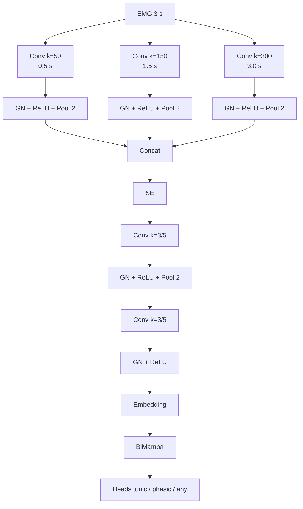

# Arquitetura proposta: encoder EMG multiescala + BiMamba

Este documento descreve a **arquitetura proposta** para o ramo de EMG/RSWA.
Trata-se de um desenho conceitual para documentação metodológica, separado da
implementação atualmente em uso no código.

## Visão geral

A ideia central é concentrar a extração multiescala na entrada do encoder,
evitando a reaplicação de kernels temporais extensos em camadas profundas sobre
representações já reduzidas por pooling. Após a fusão das escalas, convoluções
de pequeno suporte refinam localmente as features, enquanto o módulo
`BiMamba` modela as dependências temporais entre mini-épocas consecutivas.

## Diagrama em ASCII

```text
                    MULTISCALE FEATURE EXTRACTION

                           EMG 3 s
                              │
                 ┌────────────┼────────────┐
                 │            │            │
              k=50         k=150        k=300
              0.5 s         1.5 s        3.0 s
                 │            │            │
             GN + ReLU    GN + ReLU    GN + ReLU
                 │            │            │
               Pool 2       Pool 2       Pool 2
                 │            │            │
                 └────────────┼────────────┘
                              │
                           CONCAT
                              │
                              SE
                              │
                         Conv k=3/5
                              │
                          GN + ReLU
                              │
                            Pool 2
                              │
                         Conv k=3/5
                              │
                          GN + ReLU
                              │
                           EMBEDDING
                              │
                           BiMamba
                              │
                  contexto temporal intermini-época
                              │
                  heads: tonic / phasic / any
```

## Diagrama Mermaid



## Interpretação dos blocos

- `Conv k=50`, `k=150`, `k=300`:
  extração inicial em escalas temporais nominais de `0,5 s`, `1,5 s` e `3,0 s`
  para sinais a `100 Hz`.
- `Concat`:
  concatenação dos mapas de características dos três ramos ao longo da dimensão
  de canais.
- `SE`:
  recalibração adaptativa da importância relativa de cada canal/escala após a
  fusão multiescala.
- `Conv k=3/5`:
  refinamento local das features já fusionadas, com suporte temporal pequeno,
  reduzindo a dependência de padding excessivo.
- `Embedding`:
  representação vetorial compacta de cada mini-época de EMG.
- `BiMamba`:
  modelagem temporal entre mini-épocas consecutivas ao longo da sequência.
- `Heads tonic / phasic / any`:
  saídas multirrótulo independentes para os três tipos de evento.

## Motivação conceitual

Em contraste com arquiteturas nas quais kernels extensos são reutilizados em
profundidade, esta proposta separa explicitamente dois papéis:

- o encoder convolucional atua como extrator de padrões **intramini-época**;
- o `BiMamba` atua como modelador do contexto **intermini-época**.

Essa separação tende a ser mais coerente com a duração efetiva do sinal de
entrada (`3 s`) e reduz o risco de que camadas convolucionais profundas operem
predominantemente sobre padding, em vez de novas estruturas temporais do EMG.

## Texto curto para documentação

> A arquitetura proposta para o ramo EMG concentra a extração multiescala na
> entrada, por meio de três ramos paralelos com kernels de `50`, `150` e `300`
> amostras, correspondentes a escalas de `0,5 s`, `1,5 s` e `3,0 s`. As
> features extraídas são concatenadas, recalibradas por um bloco
> squeeze-and-excitation e refinadas por convoluções de pequeno suporte
> temporal, produzindo um embedding compacto por mini-época. Esse embedding é
> então processado por um módulo `BiMamba`, responsável por modelar as
> dependências temporais entre mini-épocas consecutivas, seguido pelas cabeças
> `tonic`, `phasic` e `any`.
