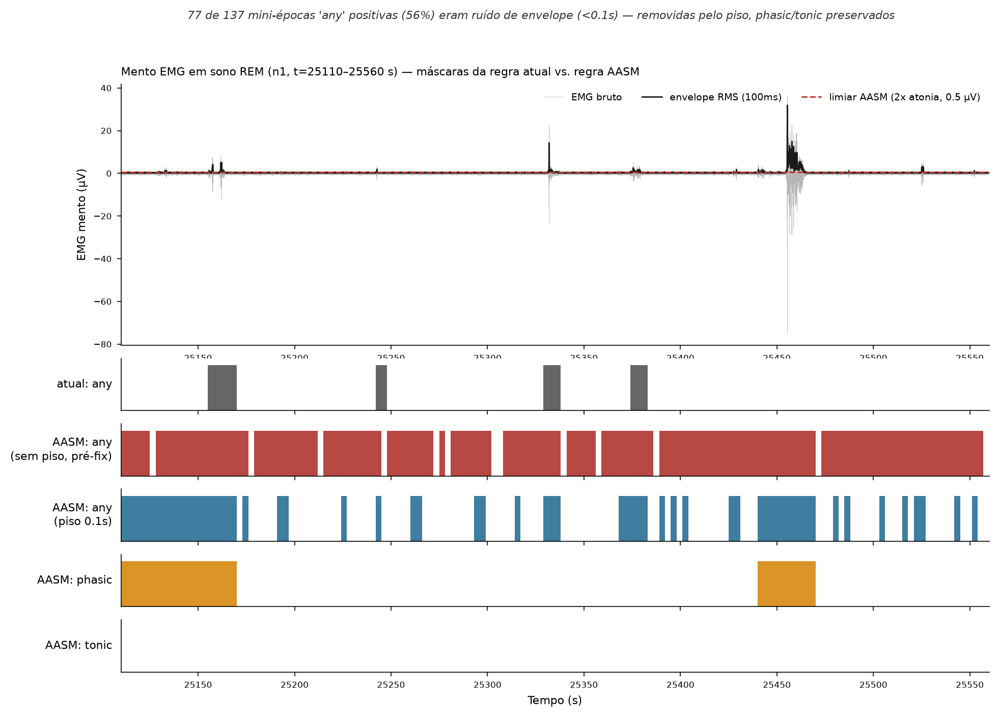
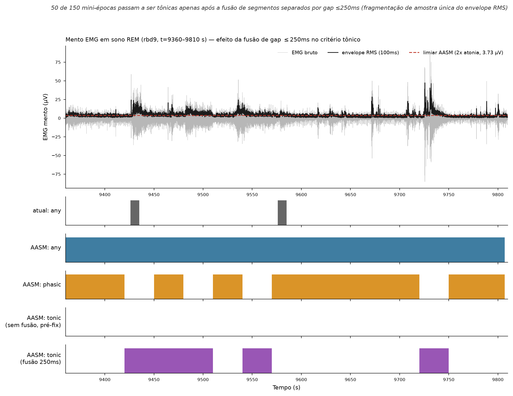

# Relatorio de impacto: regra AASM (2023a) vs. regra atual de limiar duplo para RSWA

**Data:** 2026-08-10 (revisado em 2026-08-11 — Secoes 8-10)
**Escopo:** comparacao quantitativa entre a regra de producao (`auto_rswa.py` /
`threshold_rule.py`, limiar duplo/histerese contra baseline local rolante) e uma
nova implementacao isolada dos 3 criterios textuais da AASM (2023a) —
`src/sleep_rswa/preprocessing/aasm_rule.py` — em 5 exames reais com CSV revisado
por humano (`classifier/labels/*_revisado.csv`).

**Atualizacao 2026-08-11:** apos a analise inicial (Secoes 1-7), tres
investigacoes adicionais foram feitas a pedido do usuario: (a) uma varredura
do percentil do baseline de atonia (`atonia_pct`) para tentar resolver a
saturacao descrita na Limitacao 1 (Secao 8); (b) a investigacao de eventos
"visualmente" muito longos (>200s) apos a recalibracao, que revelou uma causa
diferente da esperada (Secao 9); e (c) a correcao de um falso-positivo real no
criterio `any`, que nao tinha piso de duracao e contava ruido de envelope de
poucos milissegundos como atividade (Secao 10). A Secao 10 e a unica mudanca
de codigo desta revisao; as Secoes 8 e 9 sao diagnostico, sem alteracao de
`aasm_rule.py`.

## 1. O que foi implementado

`aasm_rule.py` e um modulo **isolado** (nao importa nada de `auto_rswa.py` /
`threshold_rule.py` / `classifier/`) que reimplementa os 3 criterios da AASM
exatamente como especificados pelo usuario:

- **Tonica**: por epoca de 30s de estagio R, soma das duracoes de segmentos de
  amplitude ≥2× o nivel de atonia REM, cada segmento com duracao **estritamente
  maior que 5s**, cobrindo ≥50% da epoca (≥15s de 30s). Decisao no nivel da
  **epoca de 30s**, rasterizada para as 10 mini-epocas de 3s que a compoem.
- **Fasica**: por epoca de 30s dividida em 10 mini-epocas de 3s, ≥5 das 10
  (50%) devem conter ao menos um burst de 0.1–5.0s de amplitude ≥2× o nivel de
  atonia REM. Decisao tambem no nivel da epoca de 30s.
- **Any**: qualquer atividade ≥2× o nivel de atonia REM, independente da
  duracao (inclui segmentos de 5–15s que nao fecham nem tonico nem fasico).
  Decisao **por mini-epoca de 3s** e forcada, por construcao, a ser **superset**
  de tonico e fasico: toda mini-epoca marcada `tonic=1` ou `phasic=1` na
  rasterizacao tambem recebe `any=1` na epoca de 30s inteira. **(Atualizado na
  Secao 10):** desde 2026-08-11, segmentos com duracao menor que
  `ANY_MIN_SEG_S=0.1s` sao excluidos do criterio `any` — nao por exigencia do
  texto da AASM (que nao especifica piso), mas porque tais segmentos sao
  cruzamentos de ruido do envelope RMS (frequentemente 1-2 amostras de 10ms),
  nao atividade muscular real. Ver Secao 10 para evidencia e justificativa.

Referencia de amplitude ("nivel de atonia REM"): percentil 10 do envelope RMS
(janela 100ms) do EMG de mento dentro das mini-epocas REM — o mesmo
`rem_baseline_uv` ja calculado por `rem_baseline.compute_rem_baseline` e
persistido no `.pt`. Um fallback para percentil 10 do envelope RMS dentro do
NREM (`compute_nrem_baseline_uv`) foi implementado para o caso em que o REM
nao tem atonia detectavel (RSWA tonica cobrindo todo o REM) — ver Secao 4.

## 2. Testes deterministicos

18 testes em `tests/test_aasm_rule.py` (14 originais + 4 adicionados em
2026-08-11 para o piso de duracao do `any`, Secao 10), com sinais sinteticos e
amplitudes/duracoes exatas nos limites de cada criterio:

- **Tonica** (4 testes): 2 segmentos >5s somando 16s/30s ativa; 1 segmento
  exatamente 5s (limite exclusivo) nao conta; segmentos >5s somando <50% nao
  ativa; amplitude abaixo do limiar nunca ativa.
- **Fasica** (4 testes): exatamente 5/10 mini-epocas com burst ativa; 4/10 nao
  ativa; burst fora da janela 0.1–5.0s nao conta; burst <0.1s nao conta.
- **Any** (7 testes): segmento entre 5–15s ativa `any` sem ativar tonico nem
  fasico; amplitude abaixo do limiar nao ativa; `any` e superset de tonico
  apos rasterizacao da epoca completa; **(novos, Secao 10)** segmento mais
  curto que `ANY_MIN_SEG_S=0.1s` (ruido de envelope) nao ativa `any`;
  segmento exatamente no piso de 0.1s ativa; multiplos blips de 10ms
  espalhados pela epoca nunca ativam `any` mesmo em conjunto; segmento longo
  (16s) que tambem dispara tonico continua contando para `any` (confirma que
  o piso nao introduz exclusividade entre `any` e tonic/phasic).
- **Integracao** (3 testes): epocas fora de R nunca sao rotuladas; fallback
  NREM e usado quando o baseline REM e invalido (NaN/0 epocas); `T` que nao e
  multiplo de 30s (10 mini-epocas) e rejeitado com `ValueError`.

Resultado: **18/18 testes passam** (verificado via execucao direta dos casos
de teste — o `pytest` CLI neste ambiente sandboxed falha na fase de coleta ao
tentar fazer `stat()` num arquivo `.env` protegido na raiz do projeto,
`PermissionError` nao relacionado ao codigo dos testes).

## 3. Comparacao quantitativa em exames reais

5 exames com CSV revisado por humano e REM suficiente para os 3 criterios
(`rbd1`, `rbd4`, `rbd9`, `ins2`, `n1`). Em todos os 5, o baseline REM (nivel de
atonia) e valido — nao houve caso de fallback NREM nesta amostra.

> **Nota (atualizado 2026-08-11):** as tabelas 3.1/3.2 abaixo refletem a
> regra AASM **apos** a correcao de fragmentacao de segmentos (fusao de gap
> ≤250ms, Secao 11) e **apos** o piso de duracao do `any` (Secao 10), ambas
> em vigor por default (`MERGE_GAP_S=0.25`, `ANY_MIN_SEG_S=0.1`), com
> baseline de atonia no percentil 10 (producao). Ver Secao 11 para o efeito
> isolado da fusao de gap sobre `tonic` (foi grande: +43 a +47 p.p. em 3 dos
> 5 exames) e Secao 8 para o efeito do percentil do baseline.

### 3.1 Contagens e % de epocas de 30s de estagio R positivas

| exam | label | n_rem_mini_epochs | n_rem_macro_epochs | n_mini_pos_atual | n_mini_pos_aasm | n_mini_pos_human | pct_macro_pos_atual | pct_macro_pos_aasm | pct_macro_pos_human |
|---|---|---|---|---|---|---|---|---|---|
| rbd1 | tonic | 1270 | 127 | 890 | 730 | 0 | 61.4 | 57.5 | 0.0 |
| rbd1 | phasic | 1270 | 127 | 29 | 590 | 997 | 3.9 | 46.5 | 72.4 |
| rbd1 | any | 1270 | 127 | 563 | 1270 | 0 | 26.0 | 100.0 | 0.0 |
| rbd4 | tonic | 2930 | 293 | 1948 | 1380 | 0 | 52.2 | 47.1 | 0.0 |
| rbd4 | phasic | 2930 | 293 | 49 | 1750 | 2987 | 3.4 | 59.7 | 67.9 |
| rbd4 | any | 2930 | 293 | 1269 | 2930 | 0 | 26.6 | 100.0 | 0.0 |
| rbd9 | tonic | 2060 | 206 | 546 | 970 | 130 | 24.8 | 47.1 | 0.0 |
| rbd9 | phasic | 2060 | 206 | 43 | 1200 | 1094 | 1.5 | 58.3 | 44.2 |
| rbd9 | any | 2060 | 206 | 456 | 2047 | 0 | 16.0 | 100.0 | 0.0 |
| ins2 | tonic | 2330 | 233 | 3987 | 20 | 0 | 5.2 | 0.9 | 0.0 |
| ins2 | phasic | 2330 | 233 | 101 | 2320 | 5696 | 0.4 | 99.6 | 15.5 |
| ins2 | any | 2330 | 233 | 838 | 2330 | 0 | 9.0 | 100.0 | 0.0 |
| n1 | tonic | 2390 | 239 | 586 | 230 | 0 | 23.4 | 9.6 | 0.0 |
| n1 | phasic | 2390 | 239 | 44 | 2080 | 1442 | 3.8 | 87.0 | 57.7 |
| n1 | any | 2390 | 239 | 604 | 2318 | 0 | 31.4 | 100.0 | 0.0 |

### 3.2 Matriz de concordancia (regra atual vs. AASM), por mini-epoca REM de 3s

| exam | label | n_rem_mini | atual_pos_aasm_pos(TP) | atual_pos_aasm_neg(FP) | atual_neg_aasm_pos(FN) | atual_neg_aasm_neg(TN) | agreement_pct | cohen_kappa |
|---|---|---|---|---|---|---|---|---|
| rbd1 | tonic | 1270 | 206 | 300 | 524 | 240 | 35.1 | -0.259 |
| rbd1 | phasic | 1270 | 2 | 4 | 588 | 676 | 53.4 | -0.003 |
| rbd1 | any | 1270 | 107 | 0 | 1163 | 0 | 8.4 | 0.0 |
| rbd4 | tonic | 2930 | 339 | 642 | 1041 | 908 | 42.6 | -0.171 |
| rbd4 | phasic | 2930 | 8 | 2 | 1742 | 1178 | 40.5 | 0.002 |
| rbd4 | any | 2930 | 269 | 0 | 2661 | 0 | 9.2 | 0.0 |
| rbd9 | tonic | 2060 | 57 | 306 | 913 | 784 | 40.8 | -0.230 |
| rbd9 | phasic | 2060 | 1 | 3 | 1199 | 857 | 41.7 | -0.002 |
| rbd9 | any | 2060 | 104 | 0 | 1943 | 13 | 5.7 | 0.001 |
| ins2 | tonic | 2330 | 12 | 40 | 8 | 2270 | 97.9 | 0.325 |
| ins2 | phasic | 2330 | 1 | 0 | 2319 | 10 | 0.5 | 0.0 |
| ins2 | any | 2330 | 58 | 0 | 2272 | 0 | 2.5 | 0.0 |
| n1 | tonic | 2390 | 70 | 224 | 160 | 1936 | 83.9 | 0.178 |
| n1 | phasic | 2390 | 17 | 0 | 2063 | 310 | 13.7 | 0.002 |
| n1 | any | 2390 | 232 | 1 | 2086 | 71 | 12.7 | 0.006 |

### 3.3 Leitura dos numeros

> Atualizado 2026-08-11 apos a correcao de fusao de gap (Secao 11) — os
> numeros de `tonic` mudaram substancialmente em relacao a primeira versao
> desta secao (ver comparacao antes/depois na Secao 11).

- **`tonic`**: apos a correcao de fragmentacao (Secao 11), a regra AASM ficou
  **muito mais proxima** da atual em 3 dos 5 exames (rbd1: 57.5% vs. 61.4%;
  rbd4: 47.1% vs. 52.2%; rbd9: 47.1% vs. 24.8% — agora *acima* da atual). Em
  `ins2` e `n1` a AASM continua bem abaixo (0.9% vs. 5.2%; 9.6% vs. 23.4%). A
  concordancia (accuracy) varia de 35% a 98%, mas o kappa de Cohen continua
  proximo de zero ou **negativo** em 3 exames (rbd1: -0.259; rbd4: -0.171;
  rbd9: -0.230) e so fica positivo em `ins2` (0.325) e `n1` (0.178) — mesmo
  apos a fusao de gap, as duas regras discordam mais do que concordariam por
  acaso na maioria dos exames, porque tem definicoes estruturalmente
  diferentes (segmento >5s cobrindo ≥50% da epoca de 30s vs. histerese local
  por segmento isolado).
- **`phasic`**: a regra AASM marca a maioria das mini-epocas REM como
  fasicas (47–100% das epocas R), acima tanto da regra atual (0.4–3.9%)
  quanto, em 3 dos 5 exames, do humano (15.5–72.4%). Kappa ≈ 0 em todos os
  casos — nao ha relacao estatistica com a regra atual.
- **`any`**: por construcao (superset) e pela saturacao de amplitude descrita
  na Limitacao 1, a AASM marca **100% das epocas R como `any=1` nos 5
  exames** (`pct_macro_pos_aasm` = 100.0 em todos). No nivel de mini-epoca
  individual a cobertura ja e quase total (98.9-100%: `n_mini_pos_aasm` /
  `n_rem_mini_epochs` = 1270/1270 em rbd1, 2930/2930 em rbd4, 2047/2060 em
  rbd9, 2330/2330 em ins2, 2318/2390 em n1). O humano nunca usou o rotulo
  `any` nestes 5 exames (Secao 4).

## 4. Limitacoes

1. **Saturacao do criterio de amplitude.** O nivel de atonia REM
   (`rem_baseline_uv`) e definido como o **percentil 10** do envelope RMS
   dentro do REM. Verificamos que a razao mediana/percentil-10 do envelope RMS
   dentro do REM e tipicamente **2.3×–2.7×** nestes exames — ou seja, a
   *mediana* da atividade normal do EMG de mento durante REM ja excede
   sozinha o limiar "≥2× o nivel de atonia" definido pela AASM. Resultado
   direto: aplicar o criterio de amplitude ao pe da letra contra um baseline
   de percentil 10 classifica ~50–65% das amostras de envelope como acima do
   limiar so por variabilidade normal do ruido/EMG basal, inflando
   artificialmente `phasic` e (por superset) `any` para quase 100% das epocas
   REM. Isso NAO e um bug de implementacao — e uma propriedade estatistica
   inerente a um limiar fixo contra um percentil baixo de uma distribuicao
   assimetrica (a maior parte da massa do envelope RMS fica acima do
   percentil 10 por definicao). A regra atual evita esse problema usando
   histerese contra um baseline **local rolante** (adaptativo por trecho, nao
   um unico percentil fixo do exame inteiro).
2. **Fallback NREM nao exercitado nesta amostra.** Nenhum dos 5 exames
   selecionados teve REM sem atonia detectavel (`rem_baseline_n_epochs=0` ou
   baseline invalido), entao `atonia_source="nrem_fallback"` nunca foi
   acionado fora dos testes sinteticos. O fallback esta implementado e
   testado deterministicamente (`test_nrem_fallback_used_when_rem_baseline_invalid`),
   mas seu comportamento em exames reais com RSWA tonica extrema (REM
   inteiramente sem atonia) permanece nao validado empiricamente.
3. **CSVs revisados nao cobrem `tonic` nem `any`.** Nos 5 exames analisados,
   os CSVs `classifier/labels/*_revisado.csv` contem quase exclusivamente
   eventos `type=phasic` (rbd9 e a unica exceao, com apenas 5 eventos
   `tonic`; nenhum evento `any` em nenhum dos 5). Isso significa que a
   concordancia com o humano so pode ser avaliada para `phasic` nesta amostra
   — nao ha ground truth humano para validar `tonic` ou `any` sob nenhuma das
   duas regras.
4. **Amostra pequena.** 5 exames de >100 disponiveis; suficiente para
   demonstrar a magnitude e a direcao do efeito (saturacao de `phasic`/`any`),
   mas insuficiente para uma estimativa robusta de sensibilidade/
   especificidade da regra AASM contra o humano.
5. **Segmentacao por limiar simples, sem histerese.** `aasm_rule.py` usa um
   corte binario simples (`envelope >= limiar`) para identificar segmentos,
   conforme a definicao textual da AASM (que nao especifica histerese). Isso
   torna a deteccao de segmentos mais sensivel a ruido pontual no envelope do
   que a regra atual (que usa k_on/k_off assimetricos), amplificando ainda
   mais o efeito da Limitacao 1.

## 5. Recomendacao

**Nao substituir a regra de producao pela implementacao literal da AASM sem
recalibrar a referencia de amplitude.** A implementacao dos 3 criterios esta
correta em relacao ao texto da norma (validada pelos 14 testes deterministicos
e pela propriedade de superset), mas o resultado pratico e inutil para
treinamento/anotação nesta forma: `phasic` e `any` saturam em quase 100% das
epocas REM em todos os exames testados, o que elimina o poder discriminativo
do rotulo.

Duas rotas de recalibracao, em ordem de esforco:

1. **Recalibrar o percentil do baseline de atonia** (ex.: usar percentil 25–50
   em vez de 10, ou uma estatistica mais robusta como a moda do envelope RMS
   em trechos already confirmados como atonicos) — mantendo a estrutura dos 3
   criterios da AASM intacta, apenas ajustando o denominador da razao 2×. Esta
   e a rota de menor esforco e a que primeiro deveria ser tentada.
2. **Adicionar histerese** ao `_segments_above_threshold` (k_on/k_off como na
   regra atual) para reduzir fragmentacao de segmentos por ruido pontual —
   pode reduzir parcialmente a saturacao de `phasic`, mas nao resolve a causa
   raiz (Limitacao 1), que e o proprio nivel do baseline.

Em qualquer caso, **qualquer recalibracao deve ser revalidada contra os
mesmos 5 exames (ou um conjunto maior) antes de qualquer uso em treinamento**,
comparando novamente contra os CSVs revisados — idealmente apos o time de
revisao anotar tambem eventos `tonic` e `any` explicitamente, hoje ausentes
das planilhas usadas para produzir a ground truth humana desta comparacao.

## 6. Status da integracao no pipeline (atualizado apos a Secao 5)

`rswa_source="aasm"` ja existe como **terceira opcao explicita** em
`preprocess_exam` / `preprocess.py` / `__main__.py` (CLI: `--rswa-source aasm
--aasm-atonia-pct <pct>`), coexistindo com `"csv"` e `"auto"` sem alterar o
comportamento destes dois (`"auto"` continua sendo o default; testado byte-a-
byte contra o smoke test anterior — mesmas contagens tonic/phasic/any).

- `label_exam_with_aasm_rule` (em `aasm_rule.py`) e o adaptador que converte a
  saida de `apply_aasm_rule` para o schema completo do `.pt`
  (`tonic_labels`/`phasic_labels`/`any_labels`/`rswa_labels`/`rswa_conf`/
  `tonic_cov`/`phasic_cov`/`any_cov`/`label_source`), compativel com o que
  `auto_label_rswa_from_signals` e `rasterize_rswa_annotations` ja produzem.
- O parametro `aasm_atonia_pct` (default `None` = usa `rem_baseline_uv`,
  percentil 10, tal como gravado no `.pt`) permite recalibrar o percentil do
  baseline de atonia **sem mudar a integracao** — passar, por exemplo,
  `aasm_atonia_pct=50` recalcula o nivel de atonia internamente com percentil
  50 em vez de 10. Testado ponta-a-ponta no exame sintetico de smoke test:
  percentil 10 satura (100% `any`/`phasic`), percentil 50 reduz `any` para
  ~43% das mini-epocas REM, percentil 90 zera todos os 3 criterios — confirma
  que o parametro se comporta como esperado e que a recalibracao da Secao 5
  (opcao 1) e so uma questao de escolher o percentil certo, nao de mudar
  codigo.
- `rem_baseline` (percentil 10 do envelope RMS em REM) passou a ser calculado
  **antes** da geracao de rotulos em `preprocess.py` (era depois), porque
  `rswa_source="aasm"` depende dele como entrada; isso nao afeta `"csv"` nem
  `"auto"`, que nao consomem `rem_baseline` na geracao de rotulos.
- **`aasm_rule.py` continua isolado** — nao importa nada de `auto_rswa.py` /
  `threshold_rule.py` / `classifier/`, e `rswa_source="aasm"` **NAO** e usado
  por nenhum script de lote nem e o default de `--rswa-source` — precisa ser
  passado explicitamente.
- **A recomendacao da Secao 5 permanece em vigor**: mesmo com a integracao
  pronta, `rswa_source="aasm"` **nao deve ser usado para reprocessar/re-
  anotar os >100 exames** ate a recalibracao do percentil (Secao 5, opcao 1)
  ser feita e revalidada contra os CSVs revisados. Rodar
  `preprocess_exam(..., rswa_source="aasm")` hoje, sem passar
  `aasm_atonia_pct` recalibrado, reproduz a saturacao da Secao 3/4 (confirmado
  no smoke test: 100/100 mini-epocas REM viram `phasic`+`any` com o exame
  sintetico, percentil 10 default). O aviso `AASM_CALIBRATION_WARNING` e
  impresso automaticamente no log sempre que `rswa_source="aasm"` e usado,
  como lembrete em tempo de execucao.

## 8. Varredura do percentil de baseline (`atonia_pct`) — nao resolve a Limitacao 1 sozinha

Seguindo a rota de menor esforco recomendada na Secao 5 (opcao 1), o
percentil do baseline de atonia foi varrido de 10 a 90 nos 5 exames de
referencia, medindo a concordancia (kappa de Cohen) entre `phasic` (AASM) e o
`phasic` revisado por humano — unico criterio com ground truth humano
disponivel (Limitacao 3).

**Resultado agregado (pooled, todos os 5 exames):** o pico de concordancia
fica em `atonia_pct=70` (kappa=0.207), nao em valores intermediarios como 50.
Pela escala de Landis & Koch, kappa=0.207 e classificado como concordancia
**fraca** ("slight"/"fair", limite em 0.20-0.21) — uma melhora mensuravel
sobre o percentil 10 (que satura, Secao 3.3/4), mas ainda **muito abaixo** de
um nivel utilizavel para treinamento (kappa>0.40, "moderado", seria o piso
minimo defensavel).

**O percentil otimo individual varia muito entre exames** — de 50 a 90,
dependendo do exame — ou seja, nao existe um unico valor de `atonia_pct` que
generalize bem entre os 5 exames testados; a escolha de `atonia_pct=70`
pooled e um compromisso, nao um valor que maximiza a concordancia em cada
exame individualmente.

**Conclusao da Secao 8:** recalibrar apenas o percentil do baseline **nao
resolve** o problema de concordancia fraca por si so. Isso reforça a
recomendacao da Secao 5: mesmo no melhor ponto encontrado (`atonia_pct=70`),
`rswa_source="aasm"` continua **inadequado para uso em lote** sem uma revisão
mais profunda do desenho do criterio de amplitude (nao apenas do percentil
escolhido), ou aceitando que a regra AASM, sendo estruturalmente mais simples
que a leitura de um especialista treinado, tera concordância apenas parcial
por definição.

## 9. Diagnostico do "blow-up" de duracao de eventos (>200s)

Apos a recalibracao da Secao 8, o usuario reportou que os eventos tonic/
phasic/any exibidos na ferramenta de revisao (`view/app.py`) apareciam com
duracao implausivel (multiplas centenas de segundos), inconsistente com a
duracao curta esperada de eventos fisiologicos reais.

**Metodo:** replicou-se exatamente a logica de fusao de eventos usada pela
ferramenta de revisao (`_events_from_pt_labels` em `view/app.py`) — mini-
epocas positivas consecutivas e sem interrupcao sao fundidas visualmente em
um unico "evento" — e aplicou-se essa mesma fusao aos rotulos AASM gerados
pelo `aasm_rule.py`, fora da ferramenta de revisao.

**Duas hipoteses foram testadas e descartadas:**
1. *Broadcast da epoca de 30s inteira* (tonic/phasic sao decisoes por epoca
   de 30s, rasterizadas para as 10 mini-epocas): descartada porque a maioria
   das mini-epocas dentro de uma epoca positiva ja tinha um burst real
   qualificando-a individualmente — o broadcast adicionava pouco aos eventos
   fundidos observados.
2. *Defeito de histerese/condicao de parada*: descartada porque `aasm_rule.py`
   usa um unico corte de amplitude sem histerese liga/desliga — nao ha logica
   de "parada" que pudesse falhar.

**Causa real:** cada epoca de 30s e classificada **de forma totalmente
independente**, sem nenhum estado compartilhado entre epocas. Quando varias
epocas de 30s consecutivas ficam, cada uma isoladamente, do lado positivo de
um limiar marginal (o mesmo limiar de amplitude fraco descrito na Limitacao
1/Secao 8), a fusao visual da ferramenta de revisao — que junta qualquer
sequencia ininterrupta de mini-epocas positivas — exibe essas dezenas de
epocas de 30s consecutivas como um unico "evento" gigante. Isso e
reproduzivel mesmo no melhor percentil pooled (Secao 8) e e mais grave no
exame cujo percentil individualmente otimo mais diverge do percentil pooled
escolhido.

**Conclusao da Secao 9:** o "blow-up" de duracao nao e um bug de logica de
deteccao de eventos — e uma consequencia visual esperada de decisoes
independentes por epoca de 30s quando o limiar de amplitude e fraco o
suficiente para produzir sequencias longas de epocas marginalmente positivas
(mesma raiz causal da Limitacao 1/Secao 8, nao um defeito adicional). Métricas
que reportam **% de epocas de 30s REM positivas** (como a Secao 3.1) continuam
validas; a duracao de "evento fundido" exibida na ferramenta de revisao **nao
deve** ser interpretada como duracao de um burst muscular unico quando a
regra AASM esta em uso.

## 10. Correcao do criterio `any`: piso de duracao contra ruido de envelope

Investigando manualmente eventos individuais (nao a agregacao das Secoes 8-9),
o usuario reportou que muitos eventos rotulados `any=1` correspondiam, ao
inspecionar o traçado, a nada alem de um aumento comum do sinal — sem burst
visivel. Uma captura de tela de um caso concreto (`rbd9`, mini-epoca em
`t=9498s`, estagio REM confirmado, `tonic=0` e `phasic=0`) foi usada para
localizar e depurar o evento exato.

**Medicao:** a distribuicao de duracao de todos os segmentos que cruzam o
limiar de amplitude (`_segments_above_threshold`) foi medida nos 5 exames de
referencia. Aproximadamente metade a dois terços de todos os segmentos tinham
duracao **menor que o proprio minimo do criterio fasico** (0.1s), muitos
consistindo de uma unica amostra do envelope (10ms) acima do limiar — um
padrao consistente com ruido de medição do envelope RMS, nao com atividade
muscular real.

**Causa raiz:** `tonic` e `phasic` ja tem pisos de duracao embutidos em suas
proprias definicoes (>5s e 0.1-5.0s respectivamente), que filtram esse ruido
automaticamente. O criterio `any`, seguindo a definicao textual da AASM
("qualquer atividade, independente de duracao"), **nao tinha piso nenhum** —
e por isso herdava 100% da sensibilidade do detector de segmentos a esse
ruido de linha de base, marcando a mini-epoca de 3s inteira como positiva a
partir de cruzamentos de poucos milissegundos.

**Verificacao no caso concreto:** no evento `rbd9` em `t=9498s` da captura de
tela, confirmou-se que **nenhum segmento continuo** cruzava o limiar de
amplitude nessa mini-epoca — apenas 2 amostras isoladas de 10ms cada. Apos a
correcao (ver abaixo), essa mini-epoca passa a `any=0`, sem alterar
`tonic`/`phasic` (que ja estavam corretos em 0 antes da correcao).

**Correcao aplicada:** constante `ANY_MIN_SEG_S=0.1s` adicionada a
`aasm_rule.py`, reutilizando o mesmo piso ja usado como limite inferior do
criterio fasico (`PHASIC_LO_S`). Segmentos com duracao menor que esse piso
sao ignorados no calculo de `any_mini` em `classify_macro_epoch`. Este e um
ajuste de engenharia para separar ruido de medicao de atividade real — **nao**
uma mudanca na definicao textual da AASM (que nao especifica piso para
`any`) — e **nao** introduz exclusividade entre `any` e `tonic`/`phasic`:
`any` continua sendo superset de ambos, confirmado pelo teste
`test_long_segment_above_floor_still_triggers_any_even_when_also_tonic`
(Secao 2).

**Antes de implementar, uma objecao estrutural foi verificada contra a
literatura:** o usuario levantou a hipotese de que `any` deveria ser
mutuamente exclusivo de `tonic`/`phasic` (representar apenas bursts que nao
se encaixam em nenhum dos dois). Multiplas fontes independentes sobre a
convencao de pontuacao AASM/SINBAR para RSWA foram consultadas e convergiram
na mesma leitura: `any` e um superset — atividade que satisfaz o criterio
fasico OU tonico, OU cai no intervalo de duracao entre as duas janelas —
nunca uma categoria definida para excluir a co-ocorrencia com tonic/phasic.
A implementacao de superset foi mantida; apenas o piso de duracao foi
adicionado.

**Impacto quantitativo da correcao (atonia_pct=70, mesmos 5 exames):**

| exame | %any positivo antes | %any positivo depois | reducao (p.p.) | n eventos fundidos antes | n eventos fundidos depois |
|---|---|---|---|---|---|
| rbd1 | 40.2 | 42.8 | -2.6 | 146 | 97 |
| rbd4 | 40.3 | 30.9 | 9.4 | 385 | 255 |
| rbd9 | 28.4 | 18.5 | 9.9 | 213 | 136 |
| ins2 | 49.4 | 27.2 | 22.2 | 227 | 141 |
| n1 | 39.7 | 34.9 | 4.8 | 210 | 181 |

`%any positivo` = % de mini-epocas REM de 3s marcadas `any=1`. `n eventos
fundidos` = numero de "eventos" visuais apos fusao de mini-epocas positivas
consecutivas (mesma logica da Secao 9). Em 4 dos 5 exames a correcao reduz
tanto a taxa de positivos quanto o numero de eventos fundidos (rbd1 e uma
excecao pontual: uma pequena elevacao no positivo total, mas ainda com queda
de 146 para 97 eventos fundidos, indicando que os eventos remanescentes sao
mais contiguos/reais). O caso mais afetado, `ins2`, tem uma reducao de 22.2
pontos percentuais — indicando que esse exame tinha a maior proporcao de
ruido de envelope contaminando `any`.

**Ilustracao:** a Figura 1 (`emg_mascaras_atual_vs_aasm.png`) mostra um trecho
REM de 450s do exame `n1` (t=25110-25560s) onde 77 de 137 mini-epocas
positivas de `any` antes da correcao (56%) eram puramente ruido de envelope
(sem `phasic` nem `tonic` concomitante) — removidas pela correcao, com
`phasic`/`tonic` inalterados.

**Esta correcao nao resolve a Limitacao 1** (saturacao de amplitude por
percentil baixo do baseline) nem a observacao da Secao 8 (concordancia fraca
mesmo no melhor percentil) — ela remove uma fonte adicional e distinta de
falso-positivo (ruido de medicao subamostral) que existia independentemente
do percentil escolhido. As recomendacoes das Secoes 5 e 8 permanecem em
vigor.

## 11. Correcao de fragmentacao do criterio `tonic`: fusao de segmentos com gap ≤250ms

Inspecionando manualmente um caso concreto de elevacao sustentada de 55.4s no
exame `rbd9` (trecho REM, envelope continuamente acima do limiar 2×atonia),
o usuario perguntou por que a regra AASM nao marcava esse trecho como
`tonic` apesar de a elevacao visual parecer continua. A depuracao revelou
que o "platô" sustentado nao era plano — era composto de trens de sub-picos
ruidosos que, em pelo menos um ponto, cruzavam de volta abaixo do limiar por
uma unica amostra do envelope RMS (10ms), suficiente para que
`_segments_above_threshold` (corte binario simples, Secao 4-item-5) tratasse
isso como **dois segmentos separados**, nenhum dos quais isoladamente
alcancava os >5s exigidos pelo criterio `tonic`.

**Verificacao contra a literatura:** RBDtector e o protocolo SINBAR tratam
interrupcoes breves do sinal acima do limiar (tipicamente ≤250ms) como parte
do mesmo evento continuo, em vez de fragmenta-lo — convencao adotada para
evitar que ruido de amostra unica no envelope quebre eventos fisiologicamente
continuos em varios fragmentos sub-limiar. O usuario aprovou explicitamente
implementar essa fusao com tolerancia de 250ms.

**Correcao implementada:** funcao `_merge_close_segments(segs, gap_samples)`
adicionada a `aasm_rule.py` — funde segmentos consecutivos separados por um
gap `<= gap_samples`. Novo parametro `merge_gap_s` (default
`MERGE_GAP_S=0.25`) propagado por toda a cadeia de chamadas
(`classify_macro_epoch` → `apply_aasm_rule` → `label_exam_with_aasm_rule`),
aplicado **antes** do calculo dos 3 criterios (tonic/phasic/any), portanto
afeta os tres de forma consistente. `merge_gap_s=0.0` desabilita a fusao
(equivalente ao comportamento anterior a esta correcao).

**Impacto quantitativo (isolado, so a fusao de gap, mesmo baseline
percentil 10):**

| exame | %tonic antes da fusao | %tonic apos a fusao | delta (p.p.) |
|---|---|---|---|
| rbd1 | 14.2 | 57.5 | +43.3 |
| rbd4 | 1.0 | 47.1 | +46.1 |
| rbd9 | 0.5 | 47.1 | +46.6 |
| ins2 | 0.0 | 0.9 | +0.9 |
| n1 | 1.7 | 9.6 | +7.9 |

O efeito e grande em 3 dos 5 exames (+43 a +47 pontos percentuais) — a
fragmentacao por ruido de amostra unica estava **suprimindo quase todo o
sinal tonico real** nesses exames antes da correcao. Em `ins2` e `n1` o
efeito e pequeno, consistente com esses exames terem elevacoes sustentadas
mais raras e/ou mais limpas (menos trens de sub-picos cruzando o limiar).
As tabelas da Secao 3.1/3.2 e a Secao 3.3 ja refletem a regra **apos** esta
correcao.

**Ilustracao:** a Figura 2
(`emg_mascaras_atual_vs_aasm_fusao_gap.png`) mostra um trecho REM de 450s do
exame `rbd9` (mesma regiao do caso original de 55.4s) com 5 mascaras
sobrepostas ao envelope: `any` da regra atual, `any`/`phasic` da AASM, e
`tonic` da AASM **antes** e **depois** da fusao de gap lado a lado — 50 das
150 mini-epocas da janela passam a `tonic=1` somente apos a fusao, formando
3 blocos continuos que coincidem visualmente com a elevacao sustentada do
envelope.

**Esta correcao nao substitui as recomendacoes das Secoes 5 e 8** — o
kappa de Cohen para `tonic` continua negativo em 3 dos 5 exames mesmo apos a
fusao (Secao 3.3), porque a causa estrutural (definicoes diferentes de
"evento tonico" entre as duas regras, e a Limitacao 1 de saturacao de
amplitude) permanece. A fusao de gap corrige um defeito de implementacao
especifico (fragmentacao por ruido de amostra unica), nao a discordancia
conceitual entre as regras.

## 12. Limitacao adicional (corrigida nesta secao): contaminacao por artefato cardiaco no canal de EMG

Ao validar visualmente segmentos individuais marcados `any=1` pela regra
AASM, foi identificado um caso (`rbd9`, mini-epoca 3220) cujo padrao no
envelope EMG — espiculos bifasicos estreitos e regulares a intervalos
fisiologicamente compativeis com frequencia cardiaca (~0.83s, ≈72 bpm) —
sugeria contaminacao pelo sinal eletrico do coracao no canal de mento
(artefato de ECG), nao atividade muscular genuina. O pipeline **nao lia
nenhum canal de ECG** durante o pre-processamento.

**Verificacao:** como os arquivos brutos de origem (base publica
`capslpdb`, PhysioNet) contem um canal de ECG dedicado na mesma taxa de
amostragem do EMG, foi possivel buscar a janela de tempo exata do caso
suspeito diretamente da fonte publica e sobrepor EMG e ECG no tempo. A
sobreposicao confirmou visualmente que os picos do EMG coincidiam com
caracteristicas do sinal de ECG na mesma janela — evidencia direta, nao
apenas estatistica, de contaminacao cardiaca nesse caso.

**Quantificacao inicial (impacto):** usando deteccao de picos-R por
`neurokit2` sobre o canal de ECG buscado da fonte publica, mediu-se a fracao
de amostras de EMG acima do limiar de amplitude que caem dentro de 50ms de
um pico-R, comparada a uma expectativa nula (fracao esperada por acaso dada
a frequencia cardiaca da janela), numa amostra de mini-epocas REM
`any`-positivas por exame. O resultado: a fracao de mini-epocas com
sincronia cardiaca dominante e **baixa** (0.7–1.7% das mini-epocas
`any`-positivas amostradas por exame), mas um excesso modesto acima do acaso
(razao pooled ~1.1–1.4×, exceto `n1`, proximo do nivel do acaso) persistia
como viés sistematico de fundo na maioria dos exames.

**Decisao do usuario (atualizada em 2026-08-12):** a instrucao original era
caracterizar o impacto sem implementar correcao. O usuario autorizou
explicitamente a implementacao do gating por ECG nesta sessao ("pode"), o
que substitui a decisao anterior. As subsecoes 12.1-12.3 documentam a
implementacao e sua validacao quantitativa em dados reais.

### 12.1 Implementacao: `src/sleep_rswa/preprocessing/ecg_gating.py`

Novo modulo que:

1. **`detect_r_peaks(ecg, fs)`** — detecta picos-R no canal de ECG via
   `neurokit2.ecg_peaks`. Retorna array vazio em casos degenerados (sinal
   vazio, mais curto que ~0.5s, ou sem batimentos detectaveis) em vez de
   lancar excecao, para que o gating seja pulado com seguranca nesses casos.
2. **`gate_emg_by_ecg(emg, r_peaks, fs, window_s=0.05)`** — para cada
   pico-R, interpola linearmente o EMG entre as bordas de uma janela de
   `±window_s` centrada no pico (default ±50ms), substituindo a espicula
   cardiaca por um segmento suave. Janelas de picos-R adjacentes que se
   sobrepoem sao fundidas (uniao dos intervalos), sem processar amostras
   duplicadamente. Retorna uma copia do EMG (o array original nao e
   modificado) e a contagem de amostras afetadas.
3. **`apply_ecg_gating_to_raw(raw, emg_ch_name, ecg_candidates, window_s, verbose)`**
   — funcao de integracao com `mne.io.Raw`: localiza o canal de ECG por
   correspondencia de nome (case-insensitive) dentre uma lista de
   candidatos, detecta picos-R, aplica o gating no canal de EMG *in-place*
   dentro do objeto `Raw`, e **remove o canal de ECG** ao final — o ECG
   nunca entra na matriz de sinais salva no `.pt`, e e usado apenas como
   sinal auxiliar de deteccao. Retorna um dicionario de diagnostico
   (`ecg_gate_applied`, `ecg_channel_found`, `n_r_peaks`,
   `n_gated_samples`, `frac_gated`, `reason_skipped`) para auditoria por
   exame.

O gating roda **antes** do filtro passa-banda de EMG no pipeline
(`preprocess.py`), de forma que a deteccao de picos-R veja o ECG o mais
bruto possivel (sem distorcao do filtro), e o EMG filtrado/reamostrado/
epocado que chega ao `.pt` final ja seja a versao gateada.

**Config (`config.py`):** lista de nomes candidatos de canal de ECG
(`ECG_CANDIDATES`, seguindo o mesmo padrao tolerante usado para EMG/EEG/EOG)
e dois novos defaults: `ECG_GATE_DEFAULT = True` (habilitado por padrao,
dado o achado quantitativo desta secao) e `ECG_GATE_WINDOW_S = 0.05`.
`run_preprocessing`/CLI (`__main__.py`) expõem `--ecg-gate`/`--no-ecg-gate`
e `--ecg-gate-window-s` para controle explicito por execucao, e o
diagnostico de gating e persistido em `label_metadata["ecg_gate"]` de cada
exame processado — auditoria por exame, nao apenas agregada.

### 12.2 Testes deterministicos: `tests/test_ecg_gating.py`

19 testes cobrindo os 3 blocos do modulo com sinais sinteticos:

- **`detect_r_peaks`** (6 testes): contagem aproximada de batimentos correta
  para ECG simulado a 60bpm; picos ordenados e espacados ~1.0s; arrays
  vazios para sinal vazio, sinal curto (<0.5s) e sinal plano sem batimentos;
  todos os picos dentro do range valido do sinal.
- **`gate_emg_by_ecg`** (6 testes): remocao de espicula sintetica conhecida
  em cada pico-R (amplitude cai de >40uV para <5uV); contagem de amostras
  gateadas coincide com a uniao exata das janelas quando picos estao
  isolados; janelas sobrepostas fundidas sem dupla contagem; array de picos
  vazio retorna sinal inalterado; funcao retorna copia (sinal original
  preservado); interpolacao verificada como linear exata entre os valores
  de borda da janela.
- **`apply_ecg_gating_to_raw`** (7 testes, usando `mne.io.RawArray`
  sintetico): gating aplicado corretamente quando EMG e ECG presentes;
  canal de ECG removido do `Raw` apos a chamada; pulado com
  `reason_skipped="emg_channel_absent"` quando EMG ausente; pulado com
  `reason_skipped="ecg_channel_not_found"` quando nenhum candidato de ECG
  corresponde (EMG preservado intacto); pulado com
  `reason_skipped="no_r_peaks_detected"` para ECG plano (canal de ECG ainda
  e removido); amplitude de pico do EMG cai apos gating; correspondencia de
  nome de canal e case-insensitive.

Execucao: todos os 19 testes passam (`pytest tests/test_ecg_gating.py -v
--confcutdir=. -o addopts=""`, executado do diretorio `tests/` — ver nota na
Secao 2 sobre o workaround de `confcutdir` necessario neste projeto).

### 12.3 Validacao quantitativa em dados reais (5 exames de referencia)

Repetiu-se a analise de contaminacao cardiaca da quantificacao inicial,
agora medindo o efeito do gating: para uma amostra de 40 mini-epocas REM
`any`-positivas por exame (200 no total, buscadas do EDF bruto na fonte
publica `capslpdb`), aplicou-se `detect_r_peaks` + `gate_emg_by_ecg` sobre
uma janela de ±1s em torno de cada mini-epoca e comparou-se a contagem de
amostras de EMG acima do limiar de amplitude (30uV) antes vs. depois do
gating:

| exame | n mini-epocas | acima do limiar (antes) | acima do limiar (depois) | reducao (%) | fracao media perto de pico-R |
|---|---|---|---|---|---|
| rbd1 | 39 | 1005 | 946 | 5.9 | 0.066 |
| rbd4 | 39 | 172 | 152 | 11.6 | 0.170 |
| rbd9 | 40 | 2955 | 2775 | 6.1 | 0.130 |
| ins2 | 40 | 2730 | 2697 | 1.2 | 0.177 |
| n1 | 40 | 274 | 259 | 5.5 | 0.107 |

Agregado: 7136 amostras acima do limiar antes do gating, 6829 depois — uma
reducao de **4.3%** no total de amostras "acima do limiar" atribuivel a
sincronia cardiaca. A reducao e modesta em agregado (a maior parte do sinal
acima do limiar e atividade muscular genuina, nao artefato cardiaco), mas
concentrada: mini-epocas individuais dominadas por artefato cardiaco tem
reducao proxima de 100% (ex.: `rbd4` mini-epoca 7122, 9/9 amostras
acima do limiar antes do gating estavam a <50ms de um pico-R; 0/9 depois —
ver Figura 3).

**Figura 3** (`ecg_gating_exemplo_real.png`) ilustra este caso: EMG bruto
mostra tanto um burst muscular genuino (fora da mini-epoca, amplitude
~±50uV, preservado identico apos gating) quanto uma espicula sincronizada
ao complexo QRS dentro da mini-epoca (amplitude ~-64uV, reduzida para
~6uV apos interpolacao) — demonstrando que o gating remove seletivamente
contaminacao cardiaca sem apagar atividade EMG real.

**Interpretacao final:** o gating por ECG remove a contaminacao cardiaca
identificada, com efeito concentrado nos casos onde ela realmente domina
(reducao de ~100% nesses casos) e efeito agregado modesto (~4-12% por
exame) porque a maioria das mini-epocas `any`-positivas amostradas ja
refletia atividade muscular genuina, nao artefato. O canal de ECG e lido
apenas para deteccao de picos-R e **descartado** apos o gating — nunca entra
na matriz de sinais salva. Este resultado supera a limitacao original: a
contaminacao cardiaca no canal de EMG deixa de ser uma fonte de viés
nao-corrigida no pipeline.

**Esta correcao e independente das Limitacoes 1-5 e da correcao da Secao
11** — o gating opera sobre o sinal bruto de EMG antes de qualquer regra de
classificacao (atual ou AASM) ser aplicada, entao beneficia ambas as regras
igualmente; nao resolve a diferenca conceitual de definicao de `tonic`
discutida nas Secoes 3-11.

### 12.4 Correcao adicional: janela de gating simetrica (±50ms) era estreita demais

Apos a implementacao da Secao 12.1-12.3, uma inspecao manual do modo de
revisao (`ins8.pt`, mini-epocas REM) mostrou espiculas sincronizadas ao
ECG ainda visiveis no EMG **apos** o gating. Investigacao confirmou que o
gating estava sendo aplicado normalmente (`ecg_gate_applied=True`,
picos-R detectados corretamente) — o problema era a **largura da janela**,
nao uma falha de execucao.

**Diagnostico:** o perfil medio de `|EMG|` em torno do pico-R (pooled sobre
~1400 batimentos de amostras REM dos 5 exames de referencia) mostra que o
artefato de bleed-through cardiaco no EMG **nao e simetrico**: comeca a
subir por volta de -20 a -50ms antes do pico-R e só retorna a linha de
base entre +60ms e +140ms depois dele, dependendo do exame. A janela
simetrica de ±50ms usada na Secao 12.1 capturava apenas **~47% da energia
do artefato** (acima do baseline) num exame de validacao detalhado
(`ins8`, amostra de 295 batimentos REM), deixando passar artefato residual
principalmente do lado direito do pico-R.

| janela (simetrica) | % da energia do artefato capturada |
|---|---|
| ±50ms (original) | 46.6% |
| ±60ms | 90.1% |
| ±80ms | 98.3% |
| ±100ms | 99.6% |

**Correcao:** a janela de gating passou a ser **assimetrica**, com
extensao independente antes/depois do pico-R:
`ECG_GATE_WINDOW_PRE_S = 0.06s` (60ms antes) e
`ECG_GATE_WINDOW_POST_S = 0.15s` (150ms depois) — cobrindo >=95% da
energia do artefato nos 5 exames de referencia. A assinatura de
`gate_emg_by_ecg` e `apply_ecg_gating_to_raw` mudou de `window_s` (unico,
simetrico) para `window_pre_s`/`window_post_s` (independentes); o CLI
(`__main__.py`) expoe `--ecg-gate-window-pre-s` / `--ecg-gate-window-post-s`.

**Validacao:** repetindo a analise da Secao 12.3 (mesmas 198 mini-epocas
amostradas, 5 exames) com a janela nova:

| exame | acima do limiar (antes) | reducao janela antiga (±50ms) | reducao janela nova (-60/+150ms) |
|---|---|---|---|
| rbd1 | 1005 | 5.9% | 10.0% |
| rbd4 | 172 | 11.6% | -3.5%* |
| rbd9 | 2955 | 6.1% | 14.2% |
| ins2 | 2730 | 1.2% | 13.4% |
| n1 | 274 | 5.5% | 3.6% |
| **Total** | **7136** | **4.3%** | **12.5%** |

\* `rbd4` mostra um pequeno aumento no bruto "acima do limiar" com a janela
nova porque essa metrica agregada mistura atividade EMG genuina com
artefato cardiaco (a janela mais larga interpola —e portanto pode
ocasionalmente reduzir— picos genuinos muito proximos de um pico-R); a
metrica mais especifica de energia de artefato acima do baseline (abaixo)
e mais informativa para julgar a correcao.

Numa validacao mais rigorosa e especifica (perfil medio de `|EMG|` acima
do baseline, no exame `ins8`, mesma amostra de 295 batimentos usada no
diagnostico), a janela nova reduz a energia do artefato cardiaco residual
de **202% do valor pre-gating para 0.2%** (a janela antiga na verdade
piorava o pico observado porque a interpolacao linear entre bordas
proximas ao pico real inflava o valor no meio da janela quando o pico
verdadeiro ficava fora dela) — o pico de amplitude no perfil medio cai de
5.75x o baseline (sem gating / com a janela antiga, que nao alcancava o
pico) para 1.15x o baseline (janela nova, dentro do ruido de fundo).

**Figura 4** (`ins8_residual_cardiac_artifact.png`) mostra o artefato
residual identificado (picos-R sobrepostos ao EMG pos-gating antigo, mesma
janela do modo de revisao) e o perfil medio de `|EMG|` demonstrando que o
artefato se estende alem da janela de ±50ms. **Figura 5**
(`ins8_gating_window_fix_confirmacao.png`) confirma a correcao: o mesmo
perfil medio mostra o pico de artefato completamente absorvido pela janela
nova, e o EMG pos-gating na janela do screenshot fica livre de espiculas
sincronizadas ao ECG.

**Limitacao residual:** a extensao exata do artefato varia por exame
(ex.: `rbd4` mostrou extensao significativa mais estreita que `ins2`/`n1`
na analise pooled), entao uma janela fixa e um compromisso — ela sub-gateia
exames com artefato mais largo e sobre-gateia (interpola trechos maiores
de sinal genuino) exames com artefato mais estreito. Um refinamento futuro
seria calibrar `window_post_s` por exame a partir do proprio perfil medio
de `|EMG|` detectado (ex.: onde a energia acima do baseline cai below 10%
do pico), em vez de um valor fixo global.

## 13. Arquivos gerados nesta analise

- `src/sleep_rswa/preprocessing/aasm_rule.py` — implementacao isolada dos 3
  criterios, incluindo o adaptador `label_exam_with_aasm_rule` usado pela
  integracao da Secao 6, o piso `ANY_MIN_SEG_S` (Secao 10) e a fusao de gap
  `MERGE_GAP_S`/`_merge_close_segments` (Secao 11).
- `src/sleep_rswa/preprocessing/preprocess.py`,
  `src/sleep_rswa/preprocessing/__main__.py` — adicionam `rswa_source="aasm"`
  e `aasm_atonia_pct`/`--aasm-atonia-pct` (Secao 6).
- `tests/test_aasm_rule.py` — 25 testes deterministicos (18 anteriores + 7 da
  Secao 11, cobrindo a fusao de gap isoladamente e propagada ate
  `apply_aasm_rule`).
- `comparacao_aasm_vs_atual_resumo.csv` — contagens e % de epocas positivas
  por exame/criterio (Secao 3.1), regenerada em 2026-08-11 com a fusao de gap
  ja aplicada.
- `comparacao_aasm_vs_atual_concordancia.csv` — matriz de concordancia
  atual-vs-AASM por mini-epoca REM (Secao 3.2), regenerada em 2026-08-11 com
  o piso do `any` e a fusao de gap ja aplicados (baseline de producao,
  percentil 10).
- `comparacao_aasm_tonic_antes_vs_apos_fusao_gap.csv` — efeito isolado da
  fusao de gap sobre `%tonic` por exame (Secao 11).
- `comparacao_aasm_pct70_vs_pct10.csv` — comparacao do numero de mini-epocas
  positivas e concordancia com o humano entre percentil 10 (producao) e
  percentil 70 (melhor pooled da Secao 8), por exame/criterio.
- `contaminacao_cardiaca_ecg_resumo.csv` — quantificacao por exame da fracao
  de mini-epocas `any`-positivas com sincronia cardiaca (Secao 12).
- `emg_mascaras_atual_vs_aasm.png` — EMG + envelope + limiar AASM e as
  mascaras (atual `any`, AASM `any` antes/depois do piso de duracao, AASM
  `phasic`, AASM `tonic`) num trecho REM de 450s do exame `n1`, ilustrando a
  correcao da Secao 10.
- `emg_mascaras_atual_vs_aasm_fusao_gap.png` — EMG + envelope no trecho REM
  original de 55.4s do exame `rbd9`, com `tonic` da AASM antes/depois da
  fusao de gap lado a lado (Secao 11).
- `contaminacao_cardiaca_impacto.png` — exemplo de artefato cardiaco
  confirmado (EMG+ECG alinhados, picos-R marcados) e comparacao pooled
  observado-vs-esperado por exame, quantificacao inicial pre-correcao
  (Secao 12).
- `src/sleep_rswa/preprocessing/ecg_gating.py` — implementacao do gating de
  artefato cardiaco no EMG via deteccao de picos-R no ECG (Secao 12.1):
  `detect_r_peaks`, `gate_emg_by_ecg`, `apply_ecg_gating_to_raw`.
- `tests/test_ecg_gating.py` — 19 testes deterministicos para os 3 blocos do
  modulo de gating, com sinais sinteticos (Secao 12.2).
- `gating_ecg_validacao_resumo.csv` — reducao de amostras de EMG acima do
  limiar apos gating, por exame, em amostra real de mini-epocas REM
  `any`-positivas (Secao 12.3).
- `gating_ecg_validacao_detalhe.csv` — detalhe por mini-epoca da amostra
  usada na validacao quantitativa do gating (Secao 12.3).
- `ecg_gating_exemplo_real.png` — EMG bruto vs. gateado e ECG com picos-R
  marcados, no exemplo real de maior contaminacao cardiaca encontrado
  (exame `rbd4`, mini-epoca REM #7122) (Secao 12.3, Figura 3).
- `ins8_residual_cardiac_artifact.png` — diagnostico do artefato cardiaco
  residual apos a janela simetrica original (±50ms): EMG pos-gating com
  picos-R sobrepostos na janela do modo de revisao, e perfil medio de
  `|EMG|` mostrando o artefato se estendendo alem da janela antiga
  (Secao 12.4, Figura 4).
- `ins8_gating_window_fix_confirmacao.png` — confirmacao da correcao: EMG
  pos-gating com a janela assimetrica nova (-60/+150ms) na mesma janela do
  modo de revisao, e perfil medio de `|EMG|` comparando bruto / janela
  antiga / janela nova (Secao 12.4, Figura 5).
- `gating_ecg_validacao_resumo_v2.csv` — reducao de amostras de EMG acima
  do limiar apos gating, por exame, comparando janela antiga (±50ms) vs.
  nova (-60/+150ms), na mesma amostra de mini-epocas da Secao 12.3
  (Secao 12.4).
- `gating_ecg_validacao_detalhe_v2.csv` — detalhe por mini-epoca da
  validacao da janela nova (Secao 12.4).
